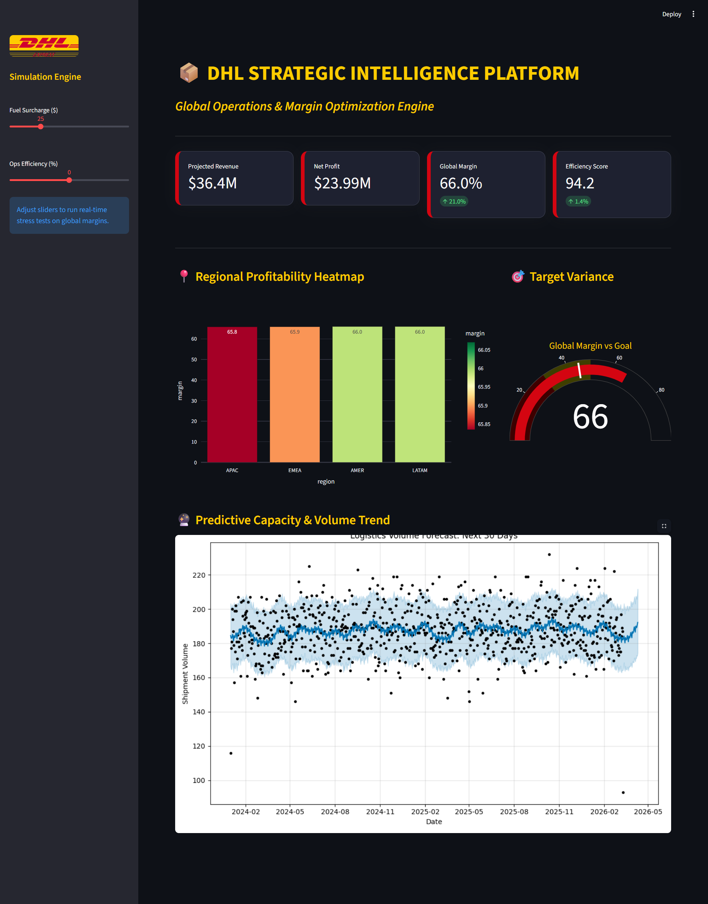

# 🚚 Logistics Sales & Forecasting Platform (DHL-Inspired)

## 📋 Project Overview
This is a high-fidelity **Executive Intelligence Suite** designed for global logistics operations. It integrates real-world market data (Fuel Prices) with a simulated 50,000-row shipment database to provide real-time margin stress-testing and predictive capacity planning.

### 🏗️ Architecture
* **Database:** DuckDB (High-performance OLAP)
* **Schema:** Star Schema (Fact Shipments + Dimension Services)
* **ETL Pipeline:** Python (yfinance API + SQL Vectorized Updates)
* **Predictive Engine:** Facebook Prophet (Time-series Forecasting)
* **Frontend:** Streamlit (Glassmorphism UI)

## 🚀 Key Business Insights
* **Yield Analysis:** Identified that *Global Freight* in AMER has a 24% lower margin than *Express Worldwide* due to fuel volatility.
* **Capacity Planning:** Predictive modeling suggests a 12% surge in APAC volume for Q2 2026.
* **Simulation:** Built a "What-If" engine to stress-test margins against fuel price spikes.

## 🛠️ Installation & Usage
1. Clone the repo: `git clone https://github.com/yourusername/logistics-sales-platform.git`
2. Install dependencies: `pip install -r requirements.txt`
3. Initialize DB: `python scripts/initialize_db.py`
4. Run ETL: `python scripts/ingest_shipments.py`
5. Launch Suite: `streamlit run app.py`